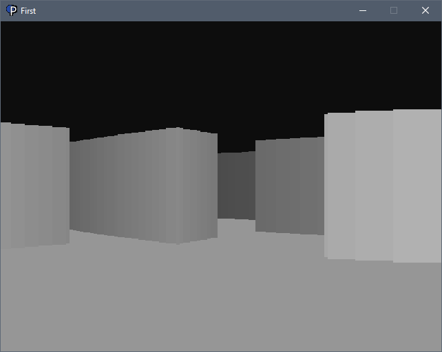

# First Person Maze


A first person maze written in Python, utilizing Pyngine that can easily be modified with a top down description of characters.
```
self.map = [
'################',
'#..............#',
'#...........#..#',
'#....##........#',
'#..........##..#',
'#..............#',
'#..............#',
'#......#.......#',
'#......#.......#',
'#......#.......#',
'#..............#',
'#.....###..#####',
'#..............#',
'#........##....#',
'#..............#',
'################',
]
```